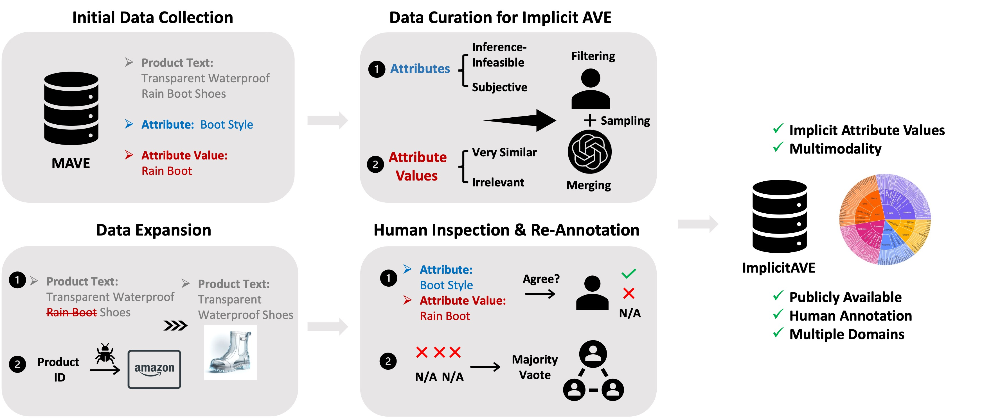

# ImplicitAVE: An Open-Source Dataset and Multimodal LLMs Benchmark for Implicit Attribute Value Extraction



This repository contains the dataset and code of the paper:
> **ImplicitAVE: An Open-Source Dataset and Multimodal LLMs Benchmark for Implicit Attribute Value Extraction** 
> [[Paper]](https://arxiv.org/pdf/2404.15592) [[arXiv]](https://arxiv.org/abs/2404.15592) [[ACL Anthology]]() [[OpenReview]](https://openreview.net/forum?id=HSZjfit7sS)  <br>
> Under Review <br>
> ACL ARR Feb Scores: Soundness - 4/4/4, Overall Assessment - 4/3.5/3.5, Meta - 4 <br>
> Henry Peng Zou, Vinay Samuel, Yue Zhou, Weizhi Zhang, Liancheng Fang, Zihe Song, Philip S. Yu, Cornelia Caragea <br>


## Datasets
Our evaluation and training data are released in the [data](https://github.com/HenryPengZou/ImplicitAVE/tree/main/data) folder. For product images, please download them from the provided links in the corresponding folder and unzip them into the same folder.


## Code
The inference code we used for [GPT-4V](https://platform.openai.com/docs/models), [BLIP-2](https://github.com/salesforce/LAVIS/tree/main/projects/blip2), [InstructBLIP](https://github.com/salesforce/LAVIS/tree/main/projects/instructblip), [LLaVA](https://github.com/haotian-liu/LLaVA?tab=readme-ov-file), [Qwen-VL](https://github.com/QwenLM/Qwen-VL), and [Qwen-VL-Chat](https://github.com/QwenLM/Qwen-VL) are provided. When running the inference code for each MLLM, please refer to the instruction in the corresponding projects for environment setup and package installation. 

Here we provide an example for setting up the environment, running the inference and evaluation code for [Qwen](https://github.com/HenryPengZou/ImplicitAVE/tree/main/code/Qwen_VL):

## Setup
```bash
# Environment setup
conda create -n Qwen python=3.9 -y
conda activate Qwen

# install pytorch
conda install pytorch==2.2.2 torchvision==0.17.2 torchaudio==2.2.2 pytorch-cuda=11.8 -c pytorch -c nvidia

# install dependency
# cd code/Qwen-VL
pip install -r requirements.txt
```

## Evaluation

To start the inference and evaluation, simply run `Qwen_VL_7B.ipynb` and `Qwen_VL_Chat.ipynb` notebooks.


You might need to change the paths to your own data paths and replace the model names with other variants you would like to use.


## Bugs or Questions

If you have any questions related to the dataset or the paper, feel free to email Henry Peng Zou (pzou3@uic.edu) and Vinay Samuel(vsamuel@andrew.cmu.edu). If you encounter any problems when using the code, or want to report a bug, you can open an issue. Please try to specify the problem with details so we can help you better and quicker!


## Citation
If you find this repository helpful, please consider citing our paper 💕: 
```bibtex
@article{zou2024implicitave,
    title={ImplicitAVE: An Open-Source Dataset and Multimodal LLMs Benchmark for Implicit Attribute Value Extraction},
    author={Henry Peng Zou and Vinay Samuel and Yue Zhou and Weizhi Zhang and Liancheng Fang and Zihe Song and Philip S. Yu and Cornelia Caragea},
    journal={arXiv preprint arXiv:2404.15592},
    year={2024}
}
```

## Acknowledgement
This repo borrows some data and codes from [MAVE](https://github.com/google-research-datasets/MAVE), [LaVIN](https://github.com/luogen1996/LaVIN/tree/main) and [Llama](https://github.com/meta-llama/llama). We appreciate their great works! <br>
